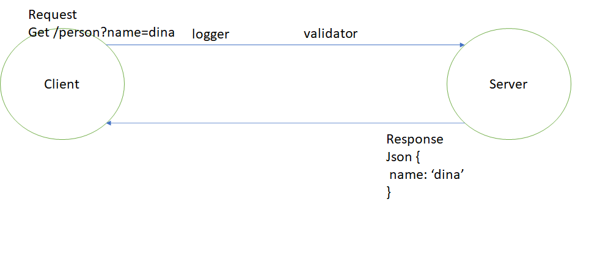

# LAB - Class 02

## Project: Basic Express Server

### Author: Dina Ayoub

### Links and Resources

- [ci/cd](https://github.com/Dina-401-Advanced-Javascript/basic-express-server/actions/new) (GitHub Actions)
- [back-end server url on heroku](https://dina-basic-express-server.herokuapp.com/)

### Setup

#### `.env` requirements (where applicable)

- `PORT` - Port Number, 3000 for us

#### How to initialize/run your application (where applicable)

- `npm start`

#### How to use your library (where applicable)

#### Tests

- `npm test`
- Tests will check:
  - 404 on a bad route (anything other than /person)
  - 404 on a bad method (anything other than get /person)
  - 500 if no name in the query string for get /person route
  - 200 if the name is in the query string for get /person route
  - given a name in the query string, the output object is correct

#### UML

